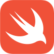

# Swift Bootcamp 

## Русскоязычная версия

Описание

В ходе этого буткемпа вы познакомитесь с мощным языком для разработки iOS - Swift.

Буткемп проходит в формате интенсива: необходимо выполнять задания каждый день и представлять свои решения другим студентам.

## Темы

 **Day00:** 
 - Типы данных, 
 - Операторы, циклы и условия
 - Использование аргументов в программе

 **Day01:** 
 - ООП, классы, протоколы, файлы, getter/setter
 - Optional переменные
 - Расширения
 - Ошибки

 **Day02:** 
 - Коллекции
 - In/out: файлы
 - Функциональные типы
 - Замыкание

 **Day03:** 
 - Дженерики
 - Subscript
 - Ленивая инициализация
 - Делегаты
 
 **Day04:** 
 - ObjectiveC
 - ObjectiveC в Swift
 - Swift в ObjectiveC
 
  **Team00:** 
 *Проект выполнен индивидуально*
 - декларативный подход к проектированию интерфейсов
 - реализация навигации в приложении
 
 **Day05:** 
 - async-await
 - конструкции SwiftRx(Observable, Single и другие)
 
 **Day06:** 
 - Использование Realm
 
 **Day07:** 
 - HTTP
 - URL
 - JSONSerialization
 - URLSession
 - Codable
 - Alamofire
 
 **Day08:** 
 - DI
 - Swinject
 
 **Day09:** 
 - Unit-тестирование
 - XcTest
 
 **Team01:** 
 *Проект выполнен индивидуально*
 - разработка сетевого слоя
 - разработка слоя получения данных
 - реализация реактивной связи UI и данных

## The English version

Description

During this bootcamp you will get to know a powerful language for iOS development - Swift.

The bootcamp takes place in an intensive format: you need to complete tasks every day and present your solutions to other students.

## Тopics

 **Day00:** 
 - Data types, Operators
 - loops and conditions
 - Use of arguments in a program

 **Day01:** 
 - OOP, classes, protocols, files, getter/setter
 - Optional variables
 - Extensions
 - Errors
 
 **Day02:** 
 - Collections
 - In/out: files
 - Functional types
 - Closure
 
 **Day03:** 
 - Generics
 - Subscript
 - Lazy initialization
 - Delegates
 
 **Day04:** 
 - ObjectiveC
 - ObjectiveC in Swift
 - Swift in ObjectiveC
 
**Team00:** 
*The project is made individually*
 - declarative approach to interface design
 - implementation of navigation in the application

 **Day05:** 
 - async-await
 - SwiftRx components(Observable, Single and others)
 
 **Day06:** 
 - How to use Realm
 
 **Day07:** 
 - HTTP
 - URL
 - JSONSerialization
 - URLSession
 - Codable
 - Alamofire
 
 **Day08:** 
 - DI
 - Swinject
 
 **Day09:** 
 - Unit-testing
 - XcTest
 
 **Team01:** 
 *The project is made individually*
 - network layer development
 - database layer development
 - implementation of UI and data reactive connection
 

